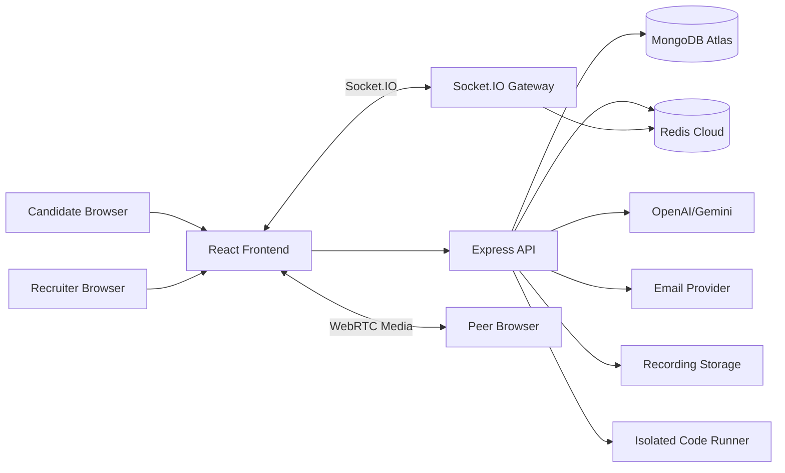
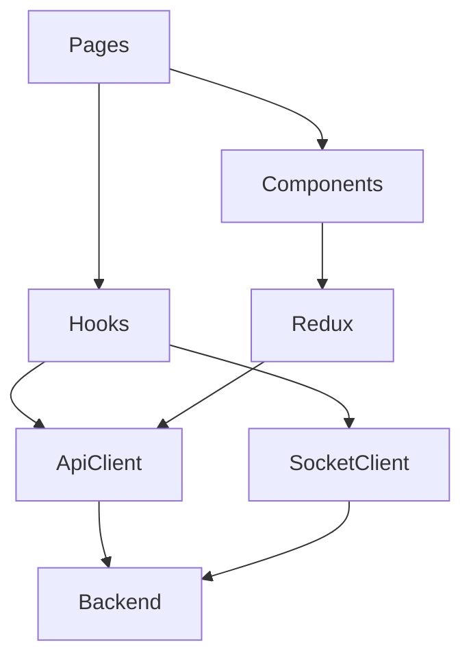
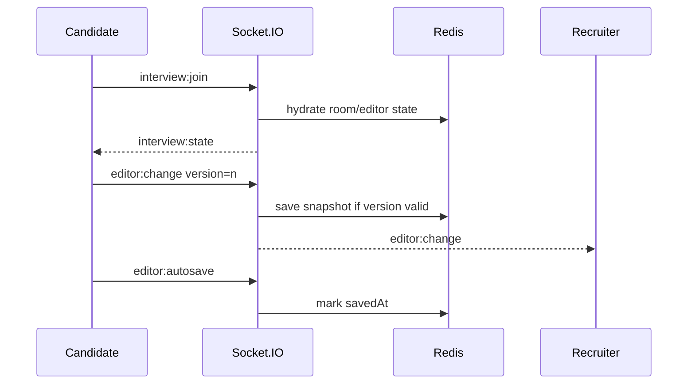
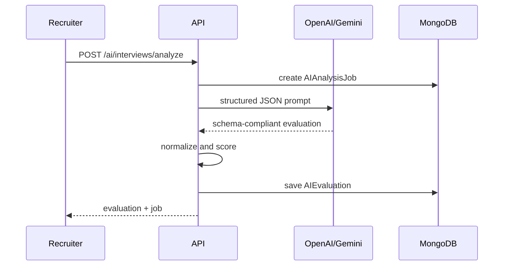
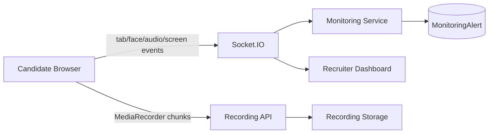

# SynapseHire Architecture

## System Overview



## Backend Architecture

The backend follows modular MVC boundaries:

```txt
routes -> controllers -> services -> models
                      -> providers
                      -> validators
```

Important modules:

- `auth`: JWT, refresh token rotation, OAuth, OTP, sessions
- `interviews`: scheduling, lifecycle, interview access control
- `sockets`: collaborative editor, WebRTC signaling, monitoring events
- `ai`: provider abstraction, prompt builder, response parser, scoring
- `monitoring`: anti-cheating alerts, recordings, recruiter dashboard
- `analytics`: recruiter/candidate/admin aggregations and CSV export

## Frontend Architecture



Frontend design principles:

- Pages compose feature components.
- API logic lives in `features/*/*Api.js`.
- Cross-page state lives in Redux slices.
- Real-time workflows use dedicated hooks.
- UI components are small, reusable, and responsive.

## Real-Time Collaboration



## AI Evaluation Flow



## Monitoring Flow



## Scalability Decisions

- Redis stores ephemeral interview room state and enables Socket.IO horizontal scaling.
- MongoDB remains source of truth for durable entities.
- AI evaluation and code execution are isolated behind service boundaries.
- Recording storage is abstracted so local disk can be replaced by S3/GCS.
- Analytics starts with MongoDB aggregations and can move to ClickHouse/BigQuery later.

## Clean Architecture Boundaries

Good interview talking point:

> Controllers are intentionally thin. Permission checks, scoring, room state, and provider logic live in services, which keeps routes stable and business logic testable.
